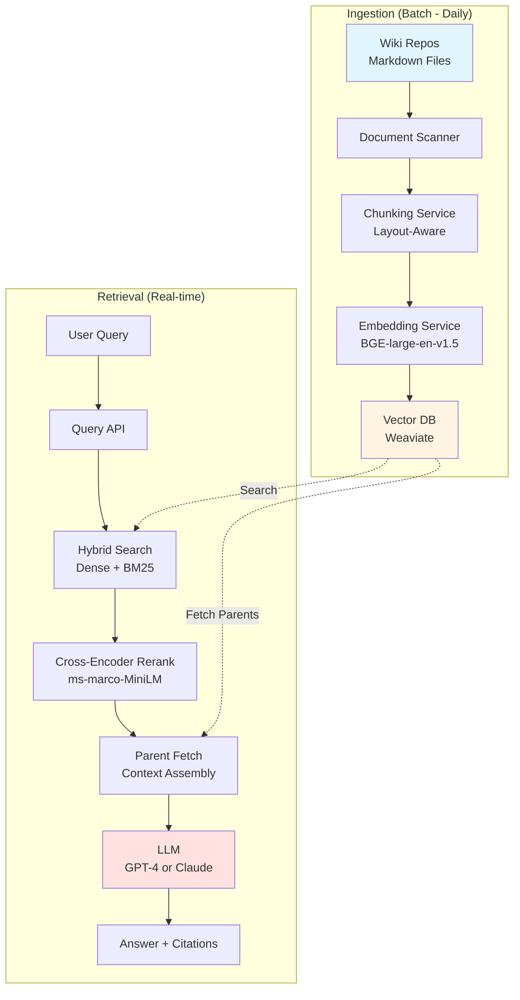

# Module 08: Implementation Guide

## Learning Objectives

After completing this module, you will understand:
- How to design database schemas for parent-child retrieval with proper metadata
- The complete RAG pipeline from ingestion through retrieval to generation
- Decision criteria for selecting vector databases, embedding models, and chunking tools
- Example architectures with data flow patterns
- Configuration approaches and operational considerations

**Prerequisites:** Modules 02 (Chunking), 03 (Embeddings), 04 (Retrieval Architecture)

**Estimated time:** 60-90 minutes

---

## Schema Design Patterns

### Core Schema: Parent-Child with Metadata

**Design principle:** Separate indexed children from stored parents.

```json
// ============================================
// COLLECTION 1: Child Chunks (Searchable)
// ============================================
{
  "collection": "child_chunks",
  "vector_config": {
    "size": 1024,              // Embedding dimensions
    "distance": "Cosine"       // Similarity metric
  },
  "sparse_vector_config": {    // For hybrid search
    "index": "inverted_index"
  },
  "document_schema": {
    "id": "string (UUID)",
    "vector": "float[1024]",
    "sparse_vector": "sparse_float",
    "payload": {
      // ===== Content =====
      "content": "string (the actual chunk text)",
      "content_hash": "string (SHA-256 for dedup)",

      // ===== Parent Relationship =====
      "parent_id": "string (references parent collection)",
      "chunk_index": "integer (position within parent, 0-indexed)",

      // ===== Hierarchical Context =====
      "heading_hierarchy": "string[] (breadcrumb trail)",
      // Example: ["Runbooks", "Database", "Disaster Recovery", "Emergency Drop"]

      // ===== Temporal Metadata =====
      "indexed_at": "datetime (ISO-8601)",
      "content_version": "string (semantic version or git commit)",
      "valid_from": "datetime (content effective date)",
      "valid_until": "datetime (null if current, date if deprecated)",

      // ===== Access Control =====
      "access_level": "string (public, internal, confidential, restricted)",
      "owning_team": "string (team responsible for content)",
      "allowed_groups": "string[] (RBAC groups with read permission)",

      // ===== Source Attribution =====
      "source_type": "string (markdown, wiki, pdf, etc.)",
      "source_path": "string (file path or URL)",
      "source_section": "string (section identifier within source)",

      // ===== Content Classification =====
      "document_type": "string (runbook, post-mortem, design-doc, etc.)",
      "tags": "string[] (user-defined classification)",
      "language": "string (ISO 639-1 code, e.g., 'en', 'es')",

      // ===== Quality Metadata =====
      "token_count": "integer (used for context budget planning)",
      "quality_score": "float (optional: content quality metric)"
    }
  }
}

// ============================================
// COLLECTION 2: Parent Documents (Storage Only)
// ============================================
{
  "collection": "parent_documents",
  "vector_config": null,  // NOT indexed for search
  "document_schema": {
    "id": "string (UUID, referenced by child chunks)",
    "payload": {
      // ===== Full Content =====
      "full_text": "string (complete section, 1000-3000 tokens typical)",
      "content_hash": "string (SHA-256 for change detection)",

      // ===== Source Metadata =====
      "source_path": "string (original file or URL)",
      "file_last_modified": "datetime",
      "git_commit_sha": "string (version control reference)",

      // ===== Temporal Metadata =====
      "created_at": "datetime",
      "updated_at": "datetime",
      "deprecated_at": "datetime (null if active)",
      "version": "string (semantic versioning)",

      // ===== Access Control =====
      "access_level": "string (inherited by children)",
      "owning_team": "string",

      // ===== Content Metadata =====
      "document_type": "string",
      "tags": "string[]",
      "heading_hierarchy": "string[]",  // Top-level hierarchy
      "child_count": "integer (number of child chunks)",

      // ===== Operational =====
      "review_due_date": "datetime (content freshness policy)",
      "last_reviewed_by": "string (user ID)",
      "change_frequency": "string (static, weekly, daily, real-time)"
    }
  }
}
```

---

### Why This Schema?

**1. Parent-Child Split (Precision + Context)**
- **Child collection:** Indexed for search → Precise matching
- **Parent collection:** Storage only → Complete context delivery
- Retrieves complete semantic units, not fragments

**2. Content Hashing (Deduplication)**
- **SHA-256 hash** of content enables:
  - Detecting exact duplicates (same content, different locations)
  - Incremental indexing (skip unchanged content on re-index)
  - Change detection (compare hash to previous version)

**3. Temporal Metadata (Version Control)**
- **`valid_from` / `valid_until`:** Filter to current vs. historical versions
- **`content_version`:** Track document evolution
- **Critical for SRE:** Yesterday's runbook may be dangerous today

**4. Access Control at Index Time**
- **Store permissions with vectors** (`access_level`, `allowed_groups`)
- **Filter during search**, not post-retrieval
- **Why:** Post-filtering after vector search reduces recall (you asked for Top-10, but 3 get filtered → only 7 returned)

**5. Heading Hierarchy (Breadcrumbs)**
- **Preserves document structure** in retrieved context
- **LLM receives:** "This is from Runbooks → Database → Disaster Recovery → Emergency Drop"
- **Improves:** Context orientation, citation quality

**6. Token Count (Context Budget Planning)**
- **Pre-compute at indexing time**
- **At retrieval:** Select Top-K chunks that fit within LLM context window (e.g., 8K tokens)
- **Avoid:** Overfilling context, truncation, wasted tokens

---

### Multi-Tenant Schema Extension

**For SaaS or multi-team environments:**

```json
{
  "payload": {
    // ... existing fields ...

    // ===== Multi-Tenancy =====
    "tenant_id": "string (organization or team identifier)",
    "namespace": "string (logical partition within tenant)",

    // Optional: Cross-tenant sharing
    "shared_with_tenants": "string[] (tenant IDs with read access)",
    "public": "boolean (accessible to all tenants)"
  }
}
```

**Implementation:**
- **Index-time:** Tag all content with `tenant_id`
- **Query-time:** Filter by `tenant_id = current_user.tenant_id`
- **Isolation:** Prevents cross-tenant leakage

**Alternative: Physical Separation**
- Separate vector DB instances per tenant
- Simpler isolation guarantees
- Trade-off: More infrastructure overhead

---

## Complete RAG Pipeline

### Phase 1: Ingestion Pipeline

**Stages:**

```
┌──────────────────────────────────────────────────────────┐
│ 1. DOCUMENT INGESTION                                    │
│    - Scan source directories (wikis, repos, S3 buckets)  │
│    - Detect new/modified files (compare timestamps/hash) │
│    - Extract metadata (file path, last modified, author) │
└──────────────────────────────────────────────────────────┘
                        ↓
┌──────────────────────────────────────────────────────────┐
│ 2. PARSING & EXTRACTION                                  │
│    - Markdown: Preserve headers, code blocks, lists      │
│    - HTML: Extract main content, strip navigation/ads    │
│    - PDF: OCR if needed, preserve structure              │
│    - Code: Extract docstrings, comments, function sigs   │
└──────────────────────────────────────────────────────────┘
                        ↓
┌──────────────────────────────────────────────────────────┐
│ 3. CHUNKING STRATEGY SELECTION (Module 02)               │
│    - Markdown/HTML: Layout-Aware Hierarchical            │
│    - Code/IaC: Code-Aware (AST-based)                    │
│    - Logs: Fixed-Size Sliding Window                     │
│    - Unstructured: Recursive or Semantic                 │
│    Output: Parent documents + Child chunks               │
└──────────────────────────────────────────────────────────┘
                        ↓
┌──────────────────────────────────────────────────────────┐
│ 4. ABSTRACT GENERATION (Optional - for dual storage)     │
│    - Use LLM to generate 100-200 token summary           │
│    - Prompt: "Summarize this section's key points..."    │
│    - Alternative: Use first paragraph as abstract        │
└──────────────────────────────────────────────────────────┘
                        ↓
┌──────────────────────────────────────────────────────────┐
│ 5. EMBEDDING GENERATION                                  │
│    - Batch child chunks (100-1000 at a time)             │
│    - Call embedding model API or self-hosted service     │
│    - Store dense vectors (1024-dim typical)              │
│    - Optional: Generate sparse vectors (SPLADE, BM25)    │
└──────────────────────────────────────────────────────────┘
                        ↓
┌──────────────────────────────────────────────────────────┐
│ 6. INDEXING                                              │
│    - Insert child chunks into vector DB (searchable)     │
│    - Insert parent documents into storage (not indexed)  │
│    - Build sparse index (inverted index for BM25)        │
│    - Create metadata indexes (tenant_id, access_level)   │
└──────────────────────────────────────────────────────────┘
                        ↓
┌──────────────────────────────────────────────────────────┐
│ 7. QUALITY VALIDATION                                    │
│    - Check token counts (400-900 range ideal)            │
│    - Validate parent-child links (no orphans)            │
│    - Test retrieval on sample queries                    │
│    - Monitor for anomalies (empty chunks, oversized)     │
└──────────────────────────────────────────────────────────┘
```

---

### Example: Ingestion Code Skeleton

```python
from typing import List, Dict
import hashlib
from datetime import datetime

class IngestionPipeline:
    def __init__(self, embedding_model, vector_db, chunker):
        self.embedding_model = embedding_model
        self.vector_db = vector_db
        self.chunker = chunker

    def ingest_document(self, file_path: str, metadata: Dict):
        """Complete ingestion pipeline for a single document."""

        # 1. Load and parse
        raw_content = self.load_file(file_path)
        parsed_doc = self.parse_document(raw_content, file_path)

        # 2. Apply chunking strategy
        parent_doc, child_chunks = self.chunker.split_document(
            content=parsed_doc.text,
            strategy=self.select_chunking_strategy(file_path),
            preserve_hierarchy=True
        )

        # 3. Compute content hash
        content_hash = hashlib.sha256(parent_doc.encode()).hexdigest()

        # 4. Check if already indexed (incremental indexing)
        existing = self.vector_db.get_parent_by_hash(content_hash)
        if existing and not metadata.get('force_reindex'):
            print(f"Skipping {file_path} - unchanged (hash: {content_hash[:8]})")
            return

        # 5. Generate parent ID
        parent_id = self.generate_uuid()

        # 6. Embed child chunks (batch for efficiency)
        child_embeddings = self.embedding_model.embed_batch([
            chunk.content for chunk in child_chunks
        ])

        # 7. Prepare child documents for indexing
        child_docs = []
        for i, (chunk, embedding) in enumerate(zip(child_chunks, child_embeddings)):
            child_docs.append({
                "id": self.generate_uuid(),
                "vector": embedding,
                "payload": {
                    "content": chunk.content,
                    "content_hash": hashlib.sha256(chunk.content.encode()).hexdigest(),
                    "parent_id": parent_id,
                    "chunk_index": i,
                    "heading_hierarchy": chunk.headers,
                    "source_path": file_path,
                    "indexed_at": datetime.utcnow().isoformat(),
                    "token_count": self.count_tokens(chunk.content),
                    **metadata  # Include access_level, tenant_id, etc.
                }
            })

        # 8. Prepare parent document
        parent_doc_obj = {
            "id": parent_id,
            "payload": {
                "full_text": parent_doc,
                "content_hash": content_hash,
                "source_path": file_path,
                "created_at": datetime.utcnow().isoformat(),
                "child_count": len(child_chunks),
                **metadata
            }
        }

        # 9. Insert into vector DB (transactional if supported)
        self.vector_db.upsert_children(child_docs, collection="child_chunks")
        self.vector_db.upsert_parent(parent_doc_obj, collection="parent_documents")

        print(f"Indexed {file_path}: {len(child_chunks)} chunks, parent {parent_id}")

    def select_chunking_strategy(self, file_path: str) -> str:
        """Choose chunking strategy based on file type."""
        if file_path.endswith('.md'):
            return 'layout_aware_hierarchical'
        elif file_path.endswith(('.py', '.tf', '.yaml')):
            return 'code_aware'
        elif 'logs/' in file_path:
            return 'fixed_size_sliding'
        else:
            return 'recursive'
```

---

### Phase 2: Retrieval Pipeline

**Stages:**

```
┌──────────────────────────────────────────────────────────┐
│ 1. QUERY PREPROCESSING                                   │
│    - Normalize query (lowercase, strip extra whitespace) │
│    - Optional: Query expansion (add synonyms)            │
│    - Optional: Query transformation (HyDE, multi-query)  │
└──────────────────────────────────────────────────────────┘
                        ↓
┌──────────────────────────────────────────────────────────┐
│ 2. METADATA FILTERING                                    │
│    - Apply access control: tenant_id, allowed_groups     │
│    - Apply temporal filter: valid_from <= now < valid_until │
│    - Apply user filters: document_type, tags, language   │
└──────────────────────────────────────────────────────────┘
                        ↓
┌──────────────────────────────────────────────────────────┐
│ 3. HYBRID RETRIEVAL (Stage 1 - Module 04)                │
│    Dense Search:                                         │
│      - Embed query using same model as indexing          │
│      - Vector search: Top-100 by cosine similarity       │
│    Sparse Search:                                        │
│      - BM25/inverted index: Top-100 by keyword score     │
│    Fusion:                                               │
│      - RRF or weighted combination                       │
│      - Output: Top-100 child chunks                      │
└──────────────────────────────────────────────────────────┘
                        ↓
┌──────────────────────────────────────────────────────────┐
│ 4. CROSS-ENCODER RERANKING (Stage 2 - Optional)          │
│    - For each of Top-100 candidates:                     │
│      - Concatenate [Query || Chunk]                      │
│      - Cross-encoder forward pass → relevance score      │
│    - Re-sort by cross-encoder scores                     │
│    - Output: Top-10 to Top-20 child chunks               │
└──────────────────────────────────────────────────────────┘
                        ↓
┌──────────────────────────────────────────────────────────┐
│ 5. PARENT DOCUMENT RETRIEVAL (Stage 3)                   │
│    - Extract parent_ids from Top-10 children             │
│    - Deduplicate parent_ids (same parent, multiple hits) │
│    - Fetch parent documents from storage collection      │
│    - Output: 3-7 complete parent documents (typical)     │
└──────────────────────────────────────────────────────────┘
                        ↓
┌──────────────────────────────────────────────────────────┐
│ 6. CONTEXT ASSEMBLY                                      │
│    - Deduplicate parents (if multiple children matched)  │
│    - Pack with Front-and-Back ordering (Module 04)       │
│    - Enforce token budget (e.g., 8K context limit)       │
│    - Add citation breadcrumbs (source_path, hierarchy)   │
└──────────────────────────────────────────────────────────┘
                        ↓
┌──────────────────────────────────────────────────────────┐
│ 7. LLM GENERATION                                        │
│    - Construct prompt with system instructions           │
│    - Insert assembled context                            │
│    - Append user query                                   │
│    - Call LLM API (GPT-4, Claude, etc.)                  │
│    - Return answer with citations                        │
└──────────────────────────────────────────────────────────┘
```

---

### Example: Retrieval Code Skeleton

```python
class RetrievalPipeline:
    def __init__(self, vector_db, embedding_model, cross_encoder=None):
        self.vector_db = vector_db
        self.embedding_model = embedding_model
        self.cross_encoder = cross_encoder

    def retrieve(self, query: str, user_context: Dict) -> List[Dict]:
        """Complete retrieval pipeline returning context for LLM."""

        # 1. Query preprocessing
        normalized_query = query.strip().lower()

        # 2. Build metadata filters
        filters = {
            "tenant_id": user_context["tenant_id"],
            "access_level": {"$in": user_context["allowed_access_levels"]},
            "valid_until": {"$gte": datetime.utcnow().isoformat()}  # Current versions only
        }

        # 3. Hybrid retrieval
        # Dense search
        query_vector = self.embedding_model.embed(query)
        dense_results = self.vector_db.search(
            collection="child_chunks",
            vector=query_vector,
            limit=100,
            filters=filters
        )

        # Sparse search (BM25)
        sparse_results = self.vector_db.keyword_search(
            collection="child_chunks",
            query=query,
            limit=100,
            filters=filters
        )

        # Fusion (RRF)
        fused_results = self.reciprocal_rank_fusion(
            dense_results, sparse_results, k=60
        )

        # 4. Cross-encoder reranking (optional)
        if self.cross_encoder:
            reranked = []
            for doc in fused_results[:100]:
                score = self.cross_encoder.predict(query, doc.payload["content"])
                reranked.append((score, doc))
            reranked.sort(reverse=True, key=lambda x: x[0])
            top_children = [doc for score, doc in reranked[:10]]
        else:
            top_children = fused_results[:10]

        # 5. Fetch parent documents
        parent_ids = list(set([child.payload["parent_id"] for child in top_children]))
        parent_docs = self.vector_db.fetch_by_ids(
            collection="parent_documents",
            ids=parent_ids
        )

        # 6. Context assembly
        context_chunks = []
        total_tokens = 0
        max_tokens = 8000  # Budget for LLM context

        for parent in parent_docs:
            tokens = parent.payload["token_count"]
            if total_tokens + tokens > max_tokens:
                break  # Respect token budget
            context_chunks.append({
                "text": parent.payload["full_text"],
                "source": parent.payload["source_path"],
                "hierarchy": parent.payload["heading_hierarchy"]
            })
            total_tokens += tokens

        return context_chunks

    def reciprocal_rank_fusion(self, list1, list2, k=60):
        """Combine two ranked lists using RRF."""
        scores = {}
        for rank, doc in enumerate(list1, start=1):
            scores[doc.id] = scores.get(doc.id, 0) + 1 / (k + rank)
        for rank, doc in enumerate(list2, start=1):
            scores[doc.id] = scores.get(doc.id, 0) + 1 / (k + rank)

        # Reconstruct documents and sort by RRF score
        all_docs = {doc.id: doc for doc in list1 + list2}
        ranked = sorted(scores.items(), key=lambda x: x[1], reverse=True)
        return [all_docs[doc_id] for doc_id, score in ranked]
```

---

## Technology Selection: Decision Criteria

### Vector Database Selection

**Do NOT choose based on:** Marketing claims, benchmark leaderboards, vendor hype

**DO choose based on:** Your specific requirements and constraints

---

**Option 1: Weaviate**

**Consider if you need:**
- **Hybrid search built-in** (dense + sparse in one query)
- **Strong multi-tenancy** (namespace isolation)
- **Modular architecture** (plug in different embedding models, rerankers)
- **GraphQL API** (if your stack already uses GraphQL)

**Trade-offs:**
- More complex setup than simpler options
- Requires understanding of Weaviate-specific concepts (classes, modules)

**When to choose:**
- You need production-grade hybrid search out of the box
- Multi-tenancy is a hard requirement
- You have engineering resources to learn the platform

---

**Option 2: PostgreSQL with pgvector**

**Consider if you need:**
- **Operational simplicity** (already running PostgreSQL)
- **Transactional consistency** (ACID guarantees for inserts/updates)
- **SQL familiarity** (use standard SQL queries)
- **Lower infrastructure overhead** (no new database to manage)

**Trade-offs:**
- Hybrid search requires custom implementation (BM25 via tsvector + pgvector)
- Performance at 100k+ documents lower than specialized vector DBs
- No built-in cross-encoder reranking

**When to choose:**
- You already have PostgreSQL infrastructure
- Corpus is small-to-medium (<100k documents)
- Operational simplicity outweighs performance optimization
- You need strong transactional semantics

---

**Option 3: Qdrant**

**Consider if you need:**
- **High performance at scale** (100k+ documents)
- **Efficient filtering** (metadata filtering during vector search)
- **Rust-based performance** (low latency, high throughput)
- **Flexible deployment** (self-hosted or managed cloud)

**Trade-offs:**
- Hybrid search requires separate sparse vector handling
- Smaller community than Elasticsearch/Weaviate

**When to choose:**
- Performance and latency are critical
- You need efficient metadata filtering at scale
- You can self-host or use Qdrant Cloud

---

**Option 4: Elasticsearch / OpenSearch**

**Consider if you need:**
- **Mature ecosystem** (large community, extensive plugins)
- **Strong keyword search** (BM25 is native strength)
- **Hybrid search support** (kNN + BM25 fusion built-in)
- **Existing Elasticsearch infrastructure**

**Trade-offs:**
- Vector search is newer feature (not original design focus)
- Configuration complexity (many tuning parameters)
- Higher resource usage than specialized vector DBs

**When to choose:**
- You already run Elasticsearch/OpenSearch for logs or metrics
- Keyword search quality is paramount
- You need battle-tested production infrastructure

---

**Decision Matrix:**

| Requirement | Best Fit |
|-------------|----------|
| **Already using PostgreSQL** | pgvector (simplicity) |
| **Hybrid search critical** | Weaviate, Elasticsearch/OpenSearch |
| **Multi-tenancy required** | Weaviate |
| **Maximum performance** | Qdrant |
| **Existing Elastic stack** | Elasticsearch/OpenSearch |
| **Small corpus (<10k)** | pgvector (simplicity) |
| **Large corpus (>100k)** | Qdrant, Weaviate |

---

### Embedding Model Selection

(See Module 03 for detailed criteria)

**Quick Decision Framework:**

```
Are you using APIs or self-hosting?
  API → Consider: OpenAI text-embedding-3, Cohere embed-v3
  Self-hosted → Consider: BGE, E5, Sentence-Transformers

What's your corpus language?
  English-only → English-specific models (higher quality)
  Multilingual → Cohere multilingual, paraphrase-multilingual

What's your typical chunk size?
  <512 tokens → Most models work
  512-2048 tokens → Need long-context model
  >2048 tokens → OpenAI text-embedding-3, Cohere v3

Do you have data residency requirements?
  Yes → Must self-host
  No → API simpler operationally

What's your query volume?
  <100k/month → API likely cheaper
  >1M/month → Self-hosted likely cheaper
```

---

### Chunking Tool Selection

**For Markdown/HTML (Layout-Aware Hierarchical):**

**Option 1: LangChain MarkdownHeaderTextSplitter**
```python
from langchain.text_splitter import MarkdownHeaderTextSplitter

splitter = MarkdownHeaderTextSplitter(
    headers_to_split_on=[
        ("#", "h1"),
        ("##", "h2"),
        ("###", "h3"),
    ]
)
```
- Preserves header hierarchy
- Splits at semantic boundaries (sections)
- Widely used, good documentation

**Option 2: Custom Parser**
- Use `markdown` library + custom logic
- Full control over chunking rules
- Can enforce token limits per chunk

---

**For Code/IaC (Code-Aware):**

**Option 1: tree-sitter (AST-based)**
```python
from tree_sitter import Language, Parser

# Parse Terraform/Python/YAML with syntax awareness
parser = Parser()
parser.set_language(Language('build/languages.so', 'terraform'))
tree = parser.parse(source_code)

# Split at resource blocks, function definitions, class boundaries
```
- Preserves syntactic validity
- Keeps complete functions/resources together
- Supports 50+ languages

**Option 2: LangChain RecursiveCharacterTextSplitter (code mode)**
- Splits at code-specific separators (function boundaries, class definitions)
- Simpler than tree-sitter but less precise
- Good for mixed code/prose (Jupyter notebooks)

---

**For Unstructured Text (Recursive or Semantic):**

**Option 1: LangChain RecursiveCharacterTextSplitter**
```python
from langchain.text_splitter import RecursiveCharacterTextSplitter

splitter = RecursiveCharacterTextSplitter(
    chunk_size=800,        # Target tokens
    chunk_overlap=200,     # Overlap to preserve context
    separators=["\n\n", "\n", ". ", " ", ""]  # Try these in order
)
```
- Reliable baseline
- Tries to split at natural boundaries (paragraphs, sentences)
- Works on any text

**Option 2: Semantic Chunker**
- Detects topic shifts using embeddings
- Higher compute cost
- Better for narrative content with variable topic lengths

---

## Example Architecture: SRE Wiki RAG System

### System Overview



---

### Data Flow Example

**Scenario:** User asks "How do I restart a crashed Kubernetes pod?"

```
1. INGESTION (one-time setup):
   - Runbook: "k8s-troubleshooting.md"
   - Section: "## Pod Crash Recovery" (1200 tokens)
   - Chunked into 3 children:
     - Child 1: "Prerequisites and diagnostics" (380 tokens)
     - Child 2: "Restart procedure steps" (420 tokens)
     - Child 3: "Validation and monitoring" (400 tokens)
   - Embedded with BGE model → Vectors stored in Weaviate
   - Parent stored: Full 1200-token section

2. RETRIEVAL (query time):
   - Query: "How do I restart a crashed Kubernetes pod?"
   - Hybrid search:
     - Dense: Finds Child 2 (semantic match to "restart procedure")
     - Sparse: Finds Child 2 (keyword match "Kubernetes pod restart")
   - Cross-encoder rerank:
     - Child 2 scores 0.91 (highly relevant)
     - Other chunks filtered out
   - Parent fetch:
     - Retrieve full "Pod Crash Recovery" section (parent_id)
   - LLM receives:
     - Complete procedure including prerequisites, steps, validation

3. ANSWER:
   "To restart a crashed Kubernetes pod:
    Prerequisites: First, check pod logs using `kubectl logs`...
    Procedure: 1. Identify the pod: `kubectl get pods -n <namespace>`...
    Source: k8s-troubleshooting.md > Pod Crash Recovery"
```

---

### Infrastructure Configuration

**Embedding Service (Self-Hosted):**
```yaml
# docker-compose.yml
services:
  embedding-service:
    image: sentence-transformers/transformers:latest
    environment:
      MODEL_NAME: "BAAI/bge-large-en-v1.5"
      MAX_BATCH_SIZE: 128
      GPU_MEMORY: "8GB"
    deploy:
      resources:
        reservations:
          devices:
            - driver: nvidia
              count: 1
              capabilities: [gpu]
    ports:
      - "8080:8080"
```

**Vector DB (Weaviate):**
```yaml
# weaviate-config.yml
services:
  weaviate:
    image: semitechnologies/weaviate:1.24.0
    environment:
      QUERY_DEFAULTS_LIMIT: 100
      AUTHENTICATION_APIKEY_ENABLED: 'true'
      AUTHORIZATION_ADMINLIST_ENABLED: 'true'
      PERSISTENCE_DATA_PATH: '/var/lib/weaviate'
      DEFAULT_VECTORIZER_MODULE: 'none'  # We provide vectors
      ENABLE_MODULES: 'text2vec-transformers,ref2vec-centroid'
    volumes:
      - weaviate-data:/var/lib/weaviate
    ports:
      - "8081:8080"
```

**Retrieval API (FastAPI):**
```python
# api.py
from fastapi import FastAPI, Depends
from pydantic import BaseModel

app = FastAPI()

class QueryRequest(BaseModel):
    query: str
    top_k: int = 5
    use_reranking: bool = True

@app.post("/retrieve")
async def retrieve(
    request: QueryRequest,
    user=Depends(get_current_user)  # Auth dependency
):
    # 1. Build filters from user context
    filters = {
        "tenant_id": user.tenant_id,
        "access_level": {"$in": user.access_levels}
    }

    # 2. Hybrid search
    results = retrieval_pipeline.retrieve(
        query=request.query,
        filters=filters,
        use_reranking=request.use_reranking,
        top_k=request.top_k
    )

    # 3. Return context chunks
    return {
        "chunks": results,
        "metadata": {
            "total_tokens": sum(c["token_count"] for c in results),
            "sources": list(set(c["source_path"] for c in results))
        }
    }
```

---

## Operational Considerations

### Incremental Indexing

**Problem:** Re-indexing 100k documents daily is wasteful (most unchanged).

**Solution: Content Hashing**

```python
def incremental_index(document_list):
    for doc in document_list:
        # Compute hash
        content_hash = hashlib.sha256(doc.content.encode()).hexdigest()

        # Check if exists with same hash
        existing = vector_db.query(
            collection="parent_documents",
            filters={"content_hash": content_hash}
        )

        if existing:
            print(f"Skipping {doc.path} - unchanged")
            continue

        # New or modified: index it
        index_document(doc)
```

**Benefits:**
- Skip unchanged content (saves embedding API calls)
- Only index new/modified documents
- Detect content drift (same file, different content)

---

### Deduplication Strategy

**Exact Duplicates:**
- Use content hash (SHA-256)
- Index only first occurrence
- Store references to all source locations

**Near Duplicates:**
- Compare embeddings (cosine similarity > 0.98)
- Index canonical version
- Link duplicates to canonical

**Conflicting Versions:**
- Same logical content, different versions
- Use temporal metadata (`valid_from`, `valid_until`)
- Filter to current version by default
- Allow historical search if needed

---

### Monitoring and Observability

**Metrics to Track:**

1. **Ingestion Health:**
   - Documents indexed per day
   - Indexing failures (parsing errors, API timeouts)
   - Average chunk count per document
   - Token distribution (ensure 400-900 range)

2. **Retrieval Quality:**
   - Zero-result queries (no matches found)
   - Low-confidence queries (top score < 0.6)
   - Retrieval latency (p50, p95, p99)
   - Parent-child link integrity (orphaned children)

3. **System Performance:**
   - Embedding API latency and rate limits
   - Vector search latency
   - Cross-encoder latency (if used)
   - Total end-to-end query time

4. **Content Freshness:**
   - Documents not updated in >90 days
   - Deprecated content still in index
   - Version distribution

**Alerting:**
- Zero-result rate > 15% (retrieval degradation)
- Indexing failures > 5% (pipeline issue)
- p95 latency > 1000ms (performance degradation)

---

## Configuration Examples

### Chunking Configuration

```yaml
# chunking_config.yaml
chunking:
  strategies:
    layout_aware_hierarchical:
      target_tokens: 600
      min_tokens: 400
      max_tokens: 900
      preserve_headers: true
      overlap_tokens: 0

    code_aware:
      target_tokens: 700
      min_tokens: 500
      max_tokens: 1000
      languages:
        - python
        - terraform
        - yaml

    fixed_size_sliding:
      chunk_size: 512
      overlap: 128

  file_type_mappings:
    ".md": layout_aware_hierarchical
    ".html": layout_aware_hierarchical
    ".py": code_aware
    ".tf": code_aware
    ".yaml": code_aware
    ".log": fixed_size_sliding
```

---

### Retrieval Configuration

```yaml
# retrieval_config.yaml
retrieval:
  hybrid_search:
    dense_weight: 0.5
    sparse_weight: 0.5
    fusion_method: rrf  # or 'weighted'
    rrf_k: 60

  reranking:
    enabled: true
    model: cross-encoder/ms-marco-MiniLM-L-6-v2
    rerank_top_n: 100  # Rerank top-100 from Stage 1
    output_top_k: 10   # Return top-10 after reranking

  parent_child:
    enabled: true
    max_parents: 7     # Limit parent documents returned
    max_tokens: 8000   # Total context budget

  filters:
    enforce_access_control: true
    default_version: current  # or 'all' for historical
    default_language: en
```

---

## Key Takeaways

### Schema Design
- **Parent-child split** enables precision (search small) + context (deliver large)
- **Content hashing** enables incremental indexing and deduplication
- **Temporal metadata** prevents serving stale/deprecated content
- **Access control at index time** prevents recall loss from post-filtering

### Pipeline Architecture
- **Ingestion:** Parse → Chunk → Embed → Index → Validate
- **Retrieval:** Filter → Hybrid Search → Rerank → Fetch Parents → Assemble Context
- **Each stage has a purpose** - don't skip stages without evaluation showing it's safe

### Technology Selection
- **Choose based on requirements**, not marketing or benchmarks
- **pgvector:** Simplicity if already using PostgreSQL
- **Weaviate:** Production hybrid search and multi-tenancy
- **Qdrant:** Performance at scale
- **Elasticsearch:** If already in your stack

### Operational Practices
- **Incremental indexing** saves cost and time
- **Deduplication** prevents context pollution
- **Monitoring** detects degradation before users complain
- **Configuration-driven** enables iteration without code changes

---

## Next Steps

**Module 06: Production Deployment** will cover:
- Scaling patterns (sharding, hierarchical indexing)
- Cost optimization strategies
- Content freshness and versioning policies
- Advanced monitoring and observability

**Module 09: SRE-Specific Considerations** will show how to apply these patterns to:
- Infrastructure as Code (Terraform, Kubernetes manifests)
- System logs and stack traces
- Runbooks and playbooks
- Post-mortems and incident reports

**Before continuing**, ensure you understand:
- Why parent-child schema design solves precision-context trade-off
- The complete ingestion and retrieval pipeline stages
- How to select technologies based on YOUR requirements (not benchmarks)
- Operational considerations for production RAG systems

---

**Next Module:** [Module 09: SRE-Specific Considerations](09-sre-specific-considerations.md) — Apply RAG patterns to runbooks, post-mortems, IaC, logs, and SRE documentation
