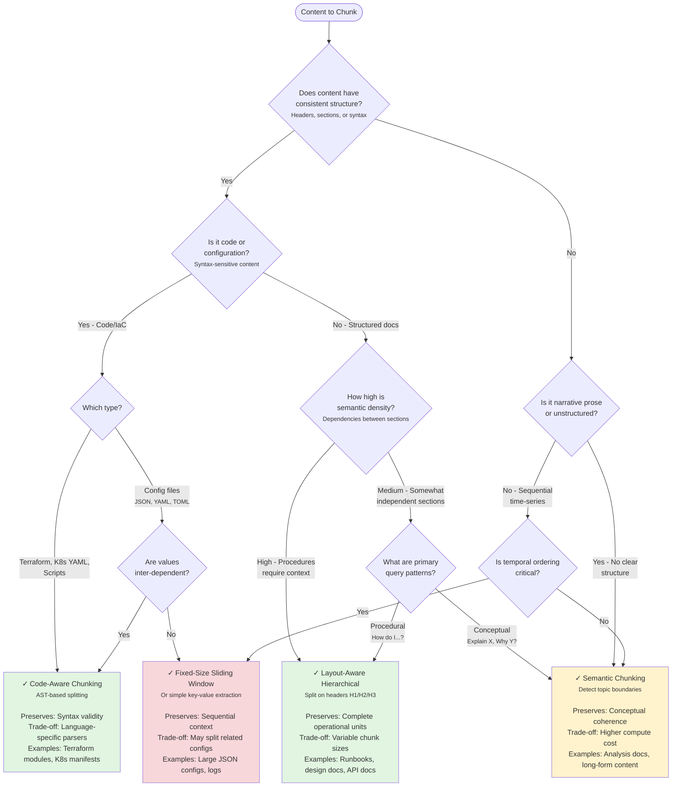
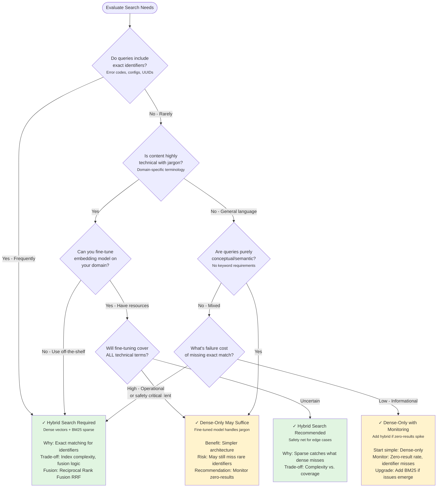
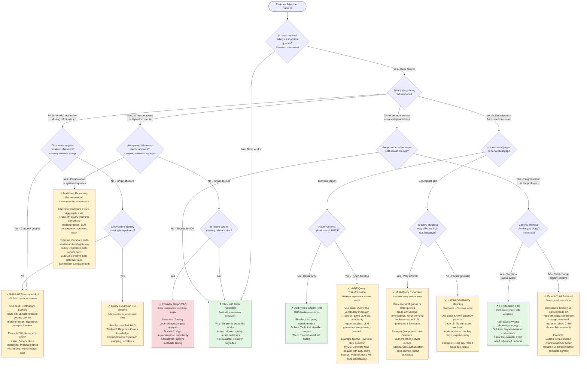

# Module 10: Decision Trees

**Learning Objective:** Quick reference flowcharts for selecting chunking strategies, retrieval architectures, and debugging quality issues.

**Reading Time:** 15-20 minutes

**Prerequisites:** Familiarity with Modules 01-07

---

## Introduction: How to Use These Decision Trees

These flowcharts are **quick reference tools** to guide common RAG system decisions. They are designed to:

- **Start with observable characteristics** (Does your content have headers? Can you accept 500ms latency?)
- **Branch on clear yes/no decisions** (avoiding subjective judgment calls)
- **End with actionable recommendations** (not "it depends")
- **Include trade-off context** in decision nodes (why this choice matters)

**When to use these:**
- **Planning a new RAG system:** Work through Decision 1 → 2 → 3 sequentially
- **Debugging quality issues:** Jump to Decision 4 (debugging flowchart)
- **Evaluating complexity trade-offs:** Use Decision 5 (advanced patterns)

**When NOT to rely solely on these:**
- Every domain has nuances—use these as starting points, not rigid rules
- For complex systems, you may need hybrid approaches (e.g., different strategies per content type)
- A/B test major decisions rather than trusting flowcharts alone

---

## Decision 1: Which Chunking Strategy Should I Use?

This flowchart applies the **Four Pillars Framework** (Module 02) to select the appropriate chunking strategy based on your content characteristics.



**Key Decision Points:**

1. **Structure Regularity:** Headers, syntax, schemas → Enables structure-aware approaches
2. **Content Type:** Code requires syntax preservation → Code-Aware mandatory
3. **Semantic Density:** High coupling → Keep complete sections together
4. **Query Patterns:** Procedural queries need complete procedures → Layout-Aware
5. **Temporal Ordering:** Logs, time-series → Fixed-Size Sliding Window

**Multi-Strategy Systems:**

Many wikis contain multiple content types. Consider:
- **Layout-Aware** for 60% of content (runbooks, design docs, post-mortems)
- **Code-Aware** for 30% (Terraform, K8s manifests, scripts)
- **Fixed-Size** for 10% (logs, stack traces, unstructured notes)

Route content to appropriate strategy based on file type, metadata, or content analysis.

---

## Decision 2: Do I Need Hybrid Search?

This flowchart helps determine if you should implement **hybrid retrieval** (dense vector + sparse BM25) or if single-stage dense-only retrieval suffices.



**Key Decision Points:**

1. **Exact Identifier Requirements:** Error codes, K8s annotations, configuration keys require sparse search
2. **Technical Jargon:** Domain-specific vocabulary may not embed well → Hybrid provides safety
3. **Fine-Tuning Capability:** If you can fine-tune embeddings on your domain, dense-only may work
4. **Failure Cost:** High-stakes environments (SRE, medical, legal) should default to hybrid
5. **Monitoring:** Start simple (dense-only), add hybrid if zero-result rate >5-10%

**In Practice:**

For **SRE/technical wikis**, hybrid search is almost always recommended because:
- Queries mix conceptual ("why is X slow?") with exact identifiers ("error 0x80040154")
- Technical terms may not be in general embedding model vocabulary
- Safety-critical context (wrong answer can cause outages)

For **general knowledge bases** (HR policies, onboarding docs), dense-only often suffices.

---

## Decision 3: When Should I Add Cross-Encoder Reranking?

Cross-encoder reranking provides **higher precision** by performing bidirectional attention on query-document pairs, but adds **latency**. This flowchart helps decide when the trade-off is worthwhile.

```mermaid
flowchart TD
    Start([Evaluate Reranking Need]) --> Q1{Can you accept<br/>100-500ms additional<br/>latency per query?}

    Q1 -->|No - Need <100ms| Q1a{Is this high-throughput<br/>API or interactive UI?}
    Q1 -->|Yes - Latency OK| Q2{Are queries complex<br/>and technical?<br/><small>Multi-concept, ambiguous</small>}

    Q1a -->|API - High volume| Skip[✗ Skip Reranking<br/><small>Latency too costly</small><br/><br/>Alternative: Optimize stage 1+2<br/>Consider: Async reranking for logging<br/>Trade-off: Speed over max precision]
    Q1a -->|UI - Interactive| Q1b{Are false positives<br/>very costly?<br/><small>Wrong answer = danger</small>}

    Q1b -->|Yes - Safety critical| RerankerRequired[✓ Cross-Encoder Required<br/><small>Despite latency</small><br/><br/>Why: Precision critical for safety<br/>Mitigation: Cache frequent queries<br/>Alternative: Lightweight reranker model]
    Q1b -->|No| Skip

    Q2 -->|Yes - Complex| Q3{What's current precision?<br/><small>Measure on eval dataset</small>}
    Q2 -->|No - Simple lookups| Q4{Is stage 1+2 retrieval<br/>already high precision?<br/><small>Precision@10 > 0.80</small>}

    Q3 -->|Precision@10 < 0.70| RerankerHigh[✓ Cross-Encoder Recommended<br/><small>High impact expected</small><br/><br/>Why: Complex queries benefit most<br/>Expect: +15-25% precision improvement<br/>Implementation: Rerank top-20 to top-10]
    Q3 -->|Precision@10 > 0.80| Q5{Are false positives<br/>in top results<br/>a major issue?}

    Q4 -->|Yes - Precision good| OptionalReranker[△ Reranking Optional<br/><small>Marginal benefit</small><br/><br/>Current system works well<br/>Reranking may improve slightly<br/>Decision: A/B test to validate]
    Q4 -->|No - Precision poor| Q6{What's causing<br/>low precision?}

    Q5 -->|Yes - Frustrating users| RerankerModerate[✓ Cross-Encoder Recommended<br/><small>Polish top results</small><br/><br/>Use case: Remove near-misses from top-5<br/>Latency: Acceptable for better UX<br/>Monitor: User feedback, click-through]
    Q5 -->|No - Acceptable| OptionalReranker

    Q6 -->|Chunking fragmentation| FixChunking[✗ Fix Chunking First<br/><small>Don't mask problem with reranking</small><br/><br/>Root cause: Chunks incomplete/fragmented<br/>Solution: Improve chunking strategy<br/>Then: Re-evaluate need for reranking]
    Q6 -->|Ranking quality| RerankerHigh
    Q6 -->|Vocabulary mismatch| AddHybrid[✗ Add Hybrid Search First<br/><small>Sparse may solve issue</small><br/><br/>Issue: Dense embeddings miss keywords<br/>Solution: BM25 + Dense hybrid<br/>Then: Re-evaluate reranking]

    style RerankerRequired fill:#e1f5e1
    style RerankerHigh fill:#e1f5e1
    style RerankerModerate fill:#e1f5e1
    style OptionalReranker fill:#fff3cd
    style Skip fill:#f8d7da
    style FixChunking fill:#f8d7da
    style AddHybrid fill:#fff3cd
```

**Key Decision Points:**

1. **Latency Budget:** Reranking adds 100-500ms. Can your application tolerate this?
2. **Query Complexity:** Simple lookups don't benefit much; complex technical queries benefit significantly
3. **Current Precision:** If Precision@10 < 0.70, reranking likely helps. If >0.80, marginal benefit.
4. **Root Cause Analysis:** Don't use reranking to mask chunking or vocabulary problems
5. **Safety Criticality:** High-stakes domains (medical, SRE) may require reranking despite latency cost

**Implementation Recommendations:**

**When Using Reranking:**
- Retrieve top-20 with stage 1+2 (hybrid search)
- Rerank to top-10 with cross-encoder
- Cache frequent queries to amortize latency
- Use lightweight models (MiniLM) for speed-sensitive applications

**When Skipping Reranking:**
- Optimize hybrid retrieval (tune BM25/dense weighting)
- Improve chunking quality (may have bigger impact than reranking)
- Monitor precision; add reranking later if quality degrades

---

## Decision 4: Is My Retrieval Quality Degrading? (Debugging Guide)

Use this flowchart when you notice quality issues: users complaining, increased zero-results, hallucinations, or failing regression tests.

```mermaid
flowchart TD
    Start([Quality Issue Detected]) --> Q1{What symptom<br/>are you observing?}

    Q1 -->|Zero results<br/>increasing| ZeroResults[Check: Zero-Result Rate]
    Q1 -->|Wrong answers<br/>despite retrieval| WrongAnswers[Check: Answer Quality]
    Q1 -->|Correct chunks retrieved<br/>but not in answer| LostMiddle[Check: Lost-in-the-Middle]
    Q1 -->|Stale or outdated<br/>content retrieved| Staleness[Check: Content Freshness]
    Q1 -->|Metrics degraded<br/><small>Recall, Precision dropped</small>| Metrics[Check: Recent Changes]

    ZeroResults --> ZQ1{Remove all metadata<br/>filters and retry.<br/>Results now?}

    ZQ1 -->|Yes - Results appear| FilterIssue[Root Cause: Metadata Filtering Too Strict<br/><br/>Investigation:<br/>- Check tenant_id, access_level filters<br/>- Verify metadata completeness in index<br/>- Review access control logic<br/><br/>Solution:<br/>- Relax overly strict filters<br/>- Fix missing metadata at ingestion]
    ZQ1 -->|No - Still zero| ZQ2{Try sparse search<br/><small>BM25 only</small><br/>Results now?}

    ZQ2 -->|Yes - Sparse works| EmbeddingIssue[Root Cause: Dense Embedding Vocabulary Mismatch<br/><br/>Investigation:<br/>- Extract technical terms from query<br/>- Check if terms are domain-specific jargon<br/>- Test query with different embedding model<br/><br/>Solution:<br/>- Enable hybrid search BM25 + Dense<br/>- Consider fine-tuning embeddings<br/>- Add query expansion for synonyms]
    ZQ2 -->|No - Still zero| IndexCompleteness[Root Cause: Content Not Indexed<br/><br/>Investigation:<br/>- Check if document exists in source<br/>- Verify ingestion pipeline ran recently<br/>- Review ingestion logs for errors<br/>- Confirm index chunk count vs expected<br/><br/>Solution:<br/>- Re-run ingestion pipeline<br/>- Fix pipeline failures<br/>- Verify deduplication not over-aggressive]

    WrongAnswers --> WQ1{Are retrieved chunks<br/>relevant and correct?<br/><small>Check retrieval logs</small>}

    WQ1 -->|Yes - Retrieval OK| LLMIssue[Root Cause: LLM Generation Problem<br/><br/>Investigation:<br/>- Review LLM prompts<br/>- Check if context is complete<br/>- Test with grounding check<br/>- Verify no conflicting info in context<br/><br/>Solution:<br/>- Improve prompts: Cite sources, refuse if unsure<br/>- Add grounding validation<br/>- Improve context assembly dedup]
    WQ1 -->|No - Wrong chunks| WQ2{Are similar-looking<br/>but irrelevant docs<br/>retrieved?}

    WQ2 -->|Yes| RankingIssue[Root Cause: Ranking/Precision Problem<br/><br/>Investigation:<br/>- Check if correct doc appears in top-20<br/>- Review metadata filters effectiveness<br/>- Measure Precision@10<br/><br/>Solution:<br/>- Add cross-encoder reranking<br/>- Tune hybrid search weighting<br/>- Improve metadata filtering]
    WQ2 -->|No - Completely<br/>irrelevant| ChunkingIssue[Root Cause: Chunking Fragmentation<br/><br/>Investigation:<br/>- Check chunk sizes avg tokens<br/>- Review if procedures split mid-step<br/>- Verify complete sections preserved<br/><br/>Solution:<br/>- Switch to layout-aware chunking<br/>- Increase target chunk size<br/>- Implement parent-child retrieval]

    LostMiddle --> LMQ1{How many chunks<br/>are you passing<br/>to LLM?}

    LMQ1 -->|>10 chunks| ContextOverload[Root Cause: Too Much Context Lost-in-Middle<br/><br/>Investigation:<br/>- Test with fewer chunks 5-7<br/>- Check if relevant info is in middle positions<br/>- Review LLM context window limits<br/><br/>Solution:<br/>- Reduce to top-5 or top-7 chunks<br/>- Add cross-encoder reranking refine top<br/>- Use parent-child retrieve small, expand<br/>- Summarize less-relevant chunks]
    LMQ1 -->|<10 chunks| LMQ2{Are chunks properly<br/>ordered and deduplicated?}

    LMQ2 -->|No - Duplicates<br/>or disorder| AssemblyIssue[Root Cause: Context Assembly Problem<br/><br/>Investigation:<br/>- Check deduplication logic<br/>- Review chunk ordering by relevance<br/>- Verify breadcrumb metadata<br/><br/>Solution:<br/>- Implement/fix deduplication<br/>- Sort by relevance score<br/>- Add section packing merge adjacent]
    LMQ2 -->|Yes - Clean context| PromptIssue[Root Cause: Prompt Engineering Issue<br/><br/>Investigation:<br/>- Test with explicit instruction to use all context<br/>- Check if LLM has attention bias<br/>- Try different prompt structures<br/><br/>Solution:<br/>- Restructure prompt put key info first<br/>- Explicitly reference all chunks<br/>- Consider summarization pre-processing]

    Staleness --> SQ1{Check metadata:<br/>Are old versions<br/>marked deprecated?}

    SQ1 -->|No - Missing flags| MetadataIssue[Root Cause: Version Metadata Missing<br/><br/>Investigation:<br/>- Check version, deprecated fields in schema<br/>- Review ingestion metadata attachment<br/>- Verify update pipeline propagates changes<br/><br/>Solution:<br/>- Add version and deprecated metadata<br/>- Filter deprecated=true at search time<br/>- Implement content review workflow]
    SQ1 -->|Yes - Properly flagged| SQ2{Are deprecated docs<br/>filtered at search?}

    SQ2 -->|No - Not filtering| FilterMissing[Root Cause: Temporal Filtering Not Enabled<br/><br/>Investigation:<br/>- Review search query construction<br/>- Check metadata filter application<br/>- Verify filter syntax<br/><br/>Solution:<br/>- Add filter: deprecated != true<br/>- Boost recent content: recency multiplier<br/>- Default to current version]
    SQ2 -->|Yes - Filtering works| RankingBias[Root Cause: Old Content Ranks Higher<br/><br/>Investigation:<br/>- Compare embedding similarity scores<br/>- Check if old doc more detailed better<br/>- Review query transformation effects<br/><br/>Solution:<br/>- Apply recency boost to scores<br/>- Improve current docs add detail<br/>- Consider temporal decay function]

    Metrics --> MQ1{What changed recently?}

    MQ1 -->|Chunking logic<br/>updated| ChunkingChange[Root Cause: Chunking Strategy Changed<br/><br/>Investigation:<br/>- Compare chunk size distribution before/after<br/>- Sample chunks: are they fragmented?<br/>- Review what logic changed<br/><br/>Solution:<br/>- Revert if degraded significantly<br/>- Re-tune chunk size parameters<br/>- Re-run evaluation dataset<br/>- Consider gradual rollout]
    MQ1 -->|Embedding model<br/>updated| EmbeddingChange[Root Cause: Embedding Model Changed Without Re-Index<br/><br/>Investigation:<br/>- Verify index was re-embedded<br/>- Check model compatibility old vs new<br/>- Test queries with new model<br/><br/>Solution:<br/>- Re-embed entire corpus with new model<br/>- Do NOT mix embeddings from different models<br/>- A/B test before full migration]
    MQ1 -->|Content added/changed| ContentDrift[Root Cause: New Content Vocabulary Drift<br/><br/>Investigation:<br/>- Check if new content uses different terminology<br/>- Measure query success on old vs new content<br/>- Review content quality consistency<br/><br/>Solution:<br/>- Standardize terminology in new content<br/>- Update query transformation synonyms<br/>- Consider fine-tuning if drift significant<br/>- Content style guide enforcement]
    MQ1 -->|Index grew significantly| ScalingIssue[Root Cause: Index Size Growth Affects Quality<br/><br/>Investigation:<br/>- Check chunk count growth rate<br/>- Measure ANN recall parameters effect<br/>- Review duplicate ingestion<br/><br/>Solution:<br/>- Tune ANN parameters HNSW ef_search<br/>- Increase retrieval K compensate<br/>- Implement hierarchical indexing<br/>- Review deduplication effectiveness]

    style FilterIssue fill:#fff3cd
    style EmbeddingIssue fill:#f8d7da
    style IndexCompleteness fill:#f8d7da
    style LLMIssue fill:#fff3cd
    style RankingIssue fill:#fff3cd
    style ChunkingIssue fill:#f8d7da
    style ContextOverload fill:#fff3cd
    style AssemblyIssue fill:#fff3cd
    style PromptIssue fill:#fff3cd
    style MetadataIssue fill:#f8d7da
    style FilterMissing fill:#fff3cd
    style RankingBias fill:#fff3cd
    style ChunkingChange fill:#f8d7da
    style EmbeddingChange fill:#f8d7da
    style ContentDrift fill:#fff3cd
    style ScalingIssue fill:#fff3cd
```



**Common Root Causes Summary:**

| Symptom | Most Likely Cause | First Action |
|---------|-------------------|--------------|
| **Zero results** | Vocabulary mismatch, content not indexed | Try sparse search; check index completeness |
| **Wrong answers** | LLM hallucination, chunking fragmentation | Check if retrieved chunks are correct |
| **Lost-in-middle** | Too many chunks, poor ordering | Reduce to top-5, add reranking |
| **Stale content** | Missing version metadata, no temporal filtering | Add `deprecated` flags, filter at search |
| **Metrics degraded** | Recent code/content change | Review recent changes, compare before/after |

---

## Decision 5: Should I Use Advanced Patterns?

Advanced patterns (Self-RAG, multi-hop, query transformation) add **complexity**. This flowchart helps determine when the benefits justify the costs.



**Key Decision Principle:**

**Always ask:** "Can I solve this by improving basics (chunking, hybrid search, reranking) before adding advanced complexity?"

**Pattern Recommendations:**

| Pattern | When to Use | Complexity | Latency Impact |
|---------|-------------|------------|----------------|
| **Self-RAG** | Iterative queries, missing info common | Medium | High (multiple retrieval rounds) |
| **Multi-Hop** | Comparative/synthesis queries | Medium | High (multiple sub-queries) |
| **HyDE** | Query-doc vocabulary mismatch | Low | Medium (1 extra LLM call) |
| **Multi-Query** | Ambiguous or terse queries | Low | Medium (multiple embeddings) |
| **Parent-Child** | Chunk boundary fragmentation | Medium | Low (index pre-built) |
| **Graph RAG** | Entity relationships, dependencies | Very High | High (graph traversal) |

**Implementation Order:**

If multiple patterns seem applicable:
1. **Fix basics first:** Chunking, hybrid search, reranking
2. **Add lightweight patterns:** HyDE, multi-query expansion
3. **Add iterative patterns:** Self-RAG, multi-hop (if basics + lightweight still fail)
4. **Consider graph patterns:** Only if relationships are critical and basics fail

---

## Quick Reference Summary

### Choosing Chunking Strategy
1. **Structured docs with headers?** → Layout-Aware Hierarchical
2. **Code or IaC?** → Code-Aware (AST-based)
3. **Unstructured narrative?** → Semantic Chunking
4. **Logs, time-series, no structure?** → Fixed-Size Sliding Window

### Deciding on Hybrid Search
1. **Exact identifiers in queries error codes, configs?** → Hybrid required
2. **Highly technical jargon?** → Hybrid recommended
3. **General language, purely conceptual?** → Dense-only may suffice
4. **When unsure?** → Start dense-only, monitor zero-results, add hybrid if >5-10%

### Adding Cross-Encoder Reranking
1. **Latency budget <100ms?** → Skip unless safety-critical
2. **Precision@10 already >0.80?** → Optional (marginal benefit)
3. **Complex technical queries + Precision@10 <0.70?** → Highly recommended
4. **Low precision from chunking issues?** → Fix chunking first, then re-evaluate

### Debugging Quality Degradation
1. **Zero results?** → Check filters, try sparse-only, verify index completeness
2. **Wrong answers?** → Check if retrieved chunks are correct (retrieval vs. LLM issue)
3. **Lost-in-middle?** → Reduce context to top-5, add reranking
4. **Stale content?** → Add version metadata, filter `deprecated=true`
5. **Metrics dropped?** → Review recent changes (code, content, model updates)

### Considering Advanced Patterns
1. **Basic retrieval works?** → Stick with simple approach
2. **Missing info common?** → Self-RAG (iterative retrieval)
3. **Multi-doc synthesis needed?** → Multi-Hop reasoning
4. **Vocabulary mismatch?** → Try hybrid first, then HyDE/multi-query
5. **Chunk boundaries lose context?** → Fix chunking first, then parent-child if needed

---

## Summary: Using These Decision Trees Effectively

**Best Practices:**

1. **Start Simple:** Work through Decision 1 → 2 → 3 in order. Don't jump to advanced patterns (Decision 5) without establishing basics.

2. **Measure Before Deciding:** Decision trees reference metrics (Precision@10, zero-result rate). **Measure your system** before making choices.

3. **Fix Root Causes:** If debugging (Decision 4) points to chunking or filtering issues, **fix those first** rather than adding complexity.

4. **Iterate:** Implement one decision, measure impact, then proceed. Don't implement all recommendations simultaneously.

5. **Context Matters:** These are guidelines, not rigid rules. Your domain may have unique characteristics.

**Anti-Patterns to Avoid:**

- ❌ Adding cross-encoder reranking without measuring current precision
- ❌ Implementing Self-RAG when basic retrieval hasn't been evaluated
- ❌ Using semantic chunking for structured content with clear headers
- ❌ Skipping hybrid search in technical domains with exact identifiers
- ❌ Deploying advanced patterns without A/B testing against simpler approaches

**Next Steps:**

- **Before implementation:** Use Decisions 1-3 to plan your architecture
- **During operation:** Use Decision 4 to debug quality issues
- **When evaluating complexity:** Use Decision 5 to justify advanced patterns

Return to **Module 02** for detailed chunking trade-offs, **Module 04** for retrieval architecture details, and **Module 07** for evaluation frameworks to measure the decisions you make here.

---

**Reading Time:** ~18 minutes

**You should now be able to:**
- ✓ Select appropriate chunking strategies for your content
- ✓ Decide when hybrid search and reranking are justified
- ✓ Debug retrieval quality issues systematically
- ✓ Evaluate when advanced patterns are worth the complexity
